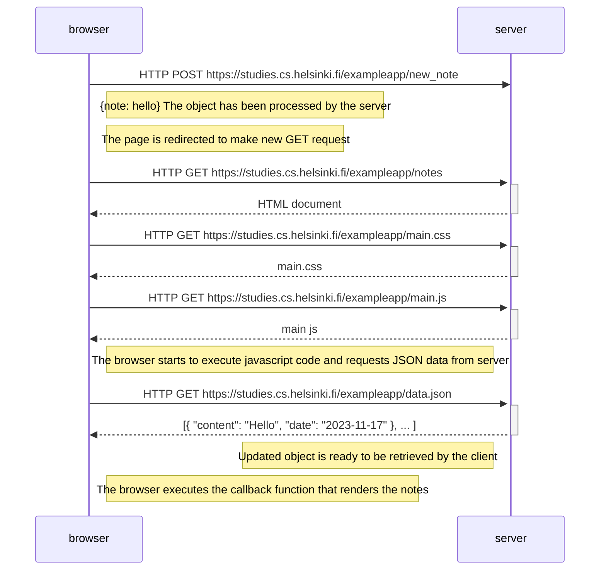

```mermaid
sequenceDiagram
    participant browser
    participant server

    browser->>server: HTTP POST https://studies.cs.helsinki.fi/exampleapp/new_note
    activate server

    Note right of browser: {note: hello} The object has been processed by the server
    Note right of browser: The page is redirected to make new GET request

    browser->>server: HTTP GET https://studies.cs.helsinki.fi/exampleapp/notes
    activate server
    server-->>browser: HTML document
    deactivate server

    browser->>server: HTTP GET https://studies.cs.helsinki.fi/exampleapp/main.css
    activate server
    server-->>browser: main.css
    deactivate server

    browser->>server: HTTP GET https://studies.cs.helsinki.fi/exampleapp/main.js
    activate server
    server-->>browser: main js
    deactivate server

    Note right of browser: The browser starts to execute javascript code and requests JSON data from server

    browser->>server: HTTP GET https://studies.cs.helsinki.fi/exampleapp/data.json
    activate server
    server-->>browser: [{ "content": "Hello", "date": "2023-11-17" }, ... ]
    deactivate server

    Note left of server: Updated object is ready to be retrieved by the client

    Note right of browser: The browser executes the callback function that renders the notes
```
