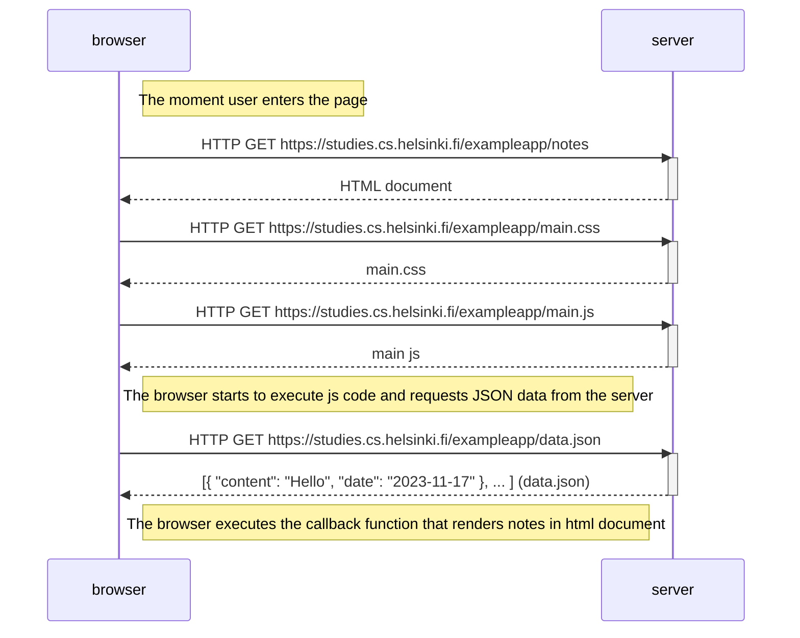

```mermaid
sequenceDiagram
    participant browser
    participant server

    Note right of browser: The moment user enters the page

    browser->>server: HTTP GET https://studies.cs.helsinki.fi/exampleapp/notes
    activate server
    server-->>browser: HTML document
    deactivate server

    browser->>server: HTTP GET https://studies.cs.helsinki.fi/exampleapp/main.css
    activate server
    server-->>browser: main.css
    deactivate server

    browser->>server: HTTP GET https://studies.cs.helsinki.fi/exampleapp/main.js
    activate server
    server-->>browser: main js
    deactivate server

    Note right of browser: The browser starts to execute js code and requests JSON data from the server

    browser->>server: HTTP GET https://studies.cs.helsinki.fi/exampleapp/data.json
    activate server
    server-->>browser: [{ "content": "Hello", "date": "2023-11-17" }, ... ] (data.json)
    deactivate server

    Note right of browser: The browser executes the callback function that renders notes in html document
```
