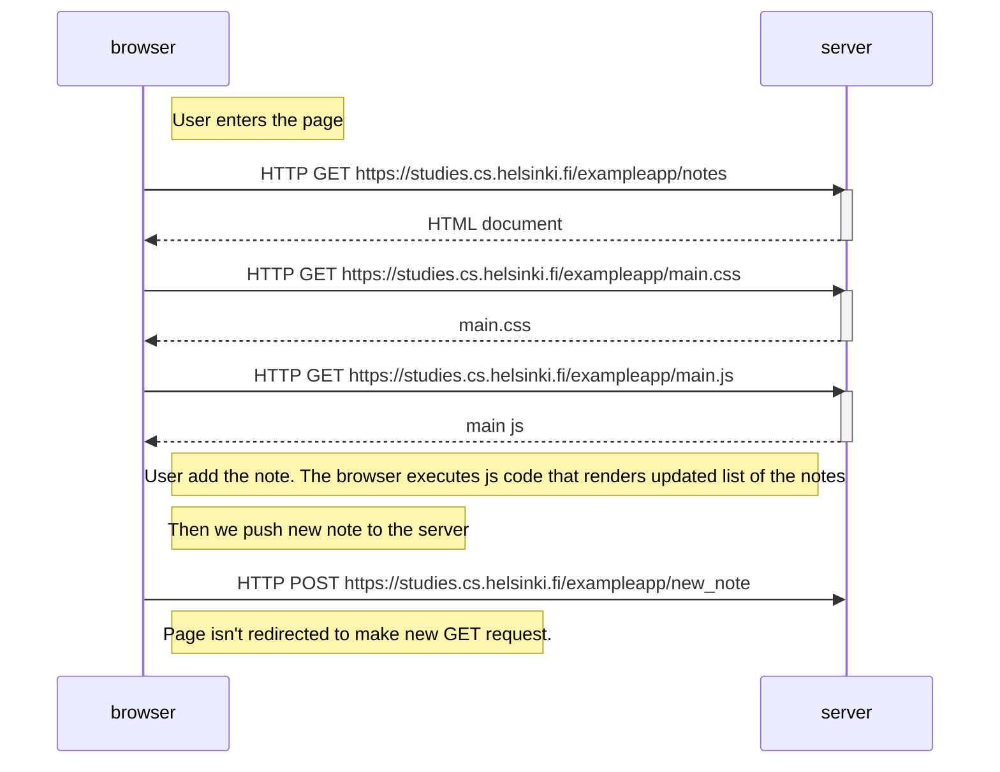

```mermaid
sequenceDiagram
    participant browser
    participant server

    Note right of browser: User enters the page

    browser->>server: HTTP GET https://studies.cs.helsinki.fi/exampleapp/notes
    activate server
    server-->>browser: HTML document
    deactivate server

    browser->>server: HTTP GET https://studies.cs.helsinki.fi/exampleapp/main.css
    activate server
    server-->>browser: main.css
    deactivate server

    browser->>server: HTTP GET https://studies.cs.helsinki.fi/exampleapp/main.js
    activate server
    server-->>browser: main js
    deactivate server

    Note right of browser: User add the note. The browser executes js code that renders updated list of the notes

    Note right of browser: Then we push new note to the server

    browser->>server: HTTP POST https://studies.cs.helsinki.fi/exampleapp/new_note
    activate server

    Note right of browser: Page isn't redirected to make new GET request.

```
